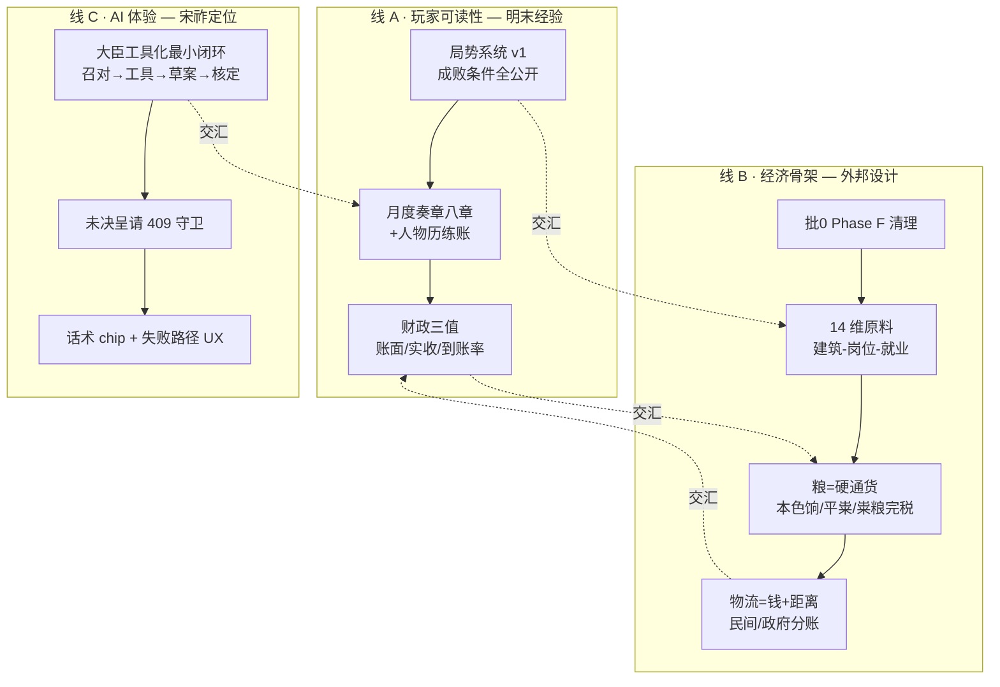

# 宋祚改进方案（合并版 · 2026-09-22）

> **输入**：① [`MingSalvageSim_经验与宋祚改善建议.md`](../../../MingSalvageSim_经验与宋祚改善建议.md)（明末 7 回合实跑 + 286 接口实测）；② [`外邦省域产业链设计_2026-09-22.md`](../docs/外邦省域产业链设计_2026-09-22.md)（v4/v5 已拍板）；③ 宋祚当前代码基线（`game全审报告.md` R3 收口，**929 passed**）。
> **原则**：明末的教训优先搬「玩家-facing 的表达」；外邦文档优先搬「守恒与产业链骨架」；两者在**财政可解释 / 州路面板 / 局势系统**三处交汇，合并排期避免撞车。

---

## 〇、先决：批 0 必须先做的两件事

### 0.1 核实外邦 Phase F 半成品（阻塞项）

外邦文档 §0.1 记载：`settlement_steps.py::_settle_external_economy` 尾部有**未完成的 Phase F 草稿**（`agg_res` 未定义 → `NameError`，实测曾把 pytest 从 891 打到 55 failed）。

**现状核对**：本轮 R3 拆分后 `settlement_econ.py::_settle_external_economy` 存活，**全量 929 passed**——草稿可能已被拆分过程清理或测试未覆盖该路径。

**动作**：跑一次「外邦省域 24 月压力测试」确认无 `NameError` / 残差漂移；若草稿仍在，按外邦文档**方案 α**（整段删除恢复基线）执行，**不要**就地补齐（与批 1 冲突面大）。

### 0.2 补一条「外邦两池守恒」回归测试

外邦文档 §10.1 要求 treasury 钱池 / 官仓粮池**各自闭合**。当前 `econ_audit` 有 money/grain 双残差，但**无专门回归测试**。补 `test_external_two_pool_conservation.py`：24 月跑辽/夏/大理，断言两池残差恒 0、岁币只记 burn 不进循环。

---

## 一、改进总图（三条线，交汇在「可解释」）

---

## 二、线 A · 玩家可读性（明末经验搬运）

### A1. 局势系统 v1 —— 单一最大借鉴（P0）

**明末做法**（实测）：每项局势 = 结构化长期任务，38 字段，**成败条件全公开** + 持续代价 + `bar_value` 进度 + `phase`/`severity` 排序。

| 局势 | 进度 | 达成条件（玩家可见） | 失败条件 | 持续代价 |
|---|---|---|---|---|
| 户部亏空 | 26 | 国库上月盈余则 +10 | 刚性支出违约 | 国库 −10 万、民心 −1/月 |
| 陕西流寇起 | 25 | 陕西民心≥60、动乱≤30、士气≥50 连续 2 月 | 动乱≥85 且民心≤30，或破州县 | 国库 −5 万、陕西民心 −2 |

**宋祚落地**（`core/situations.py` 已有 DSL，升级即可）：
1. 局势对象补 `resolve_condition` / `fail_condition` / `ongoing_cost` / `bar_good_meaning` / `bar_bad_meaning`（**明文写进 UI**）
2. `progress_mode` 分流：`bar`（进度条）与 `goal`（只判进行/达成/失败）
3. 首批 3 个局势直接照搬明末语义，换成宋名：**「花石纲民怨」「东南财政亏空」「辽事边备」**
4. 验收：玩家打开面板 3 秒答出「怎么算赢 / 怎么算崩 / 不动会怎样」

### A2. 月度奏章八章（P1）

**明末做法**：每回合 2,200–4,000 字结构化奏章，八章固定 + 章末七言联 + **人物属性涨跌账**：
> 毕自严：管理涨1（92→93）…；祖大寿：忠诚涨1（80→81）…

**宋祚落地**（`settlement_log` → `GazettePanel` 升级）：
- 固定八章：`诏书核销 / 指令核销 / 长期局势 / 密令动向 / 讣闻登场 / 人物历练 / 军事 / 邦交`
- 必补三章：**① 局势进展逐条 ② 人物历练/属性涨跌 ③ 密令动向**——把「看不见的数值变化」翻译成可读叙事
- 章末七言联可用 `narrative_fallback` 模板池 + AI 润色
- 与 R3 已修的「回合差值高亮」（`snapshotHud` before/after）合并：每章末给 ▲▼ 摘要

### A3. 财政三值 + hover 公式（P0，与线 B 交汇）

**明末做法**（实测）：`田赋: amount=69.52 base=79.0 formula="官民田63090万亩×田赋亩率…→到账率约38%"`；实测「加税 ≠ 增收」——商税定额提到 36 万/月，实解仅 22.88 万。

**宋祚落地**（`AccountingPanel` + `core/money.py` 对账视图）：
1. 每笔收支三值并列：**账面应征 / 实收 / 到账率**（宋已有 `arrival_rate_base`，只差 UI 暴露）
2. 每行带 `formula` 字符串（悬停展开）：税基 × 率 × 到账率 = 实收
3. 与外邦 §10.3「诊断读数」统一：残差、到账率、物流费、倒闭数一屏
4. 验收：玩家能回答「为什么加税反而变穷」

---

## 三、线 B · 经济骨架（外邦设计 v4/v5，已拍板直接做）

> 依据 `外邦省域产业链设计_2026-09-22.md`，此处只排期与交汇点，**不复述已拍板细节**。

### B1. 建筑-岗位-就业模型（P0，2–3 周）
- 6 类建筑 / 岗位数 = `lv × JOBS_PER_LEVEL`（**粮维豁免**）/ 优先队列就业
- 产出两轨制 + 余粮商品化；去建筑折旧；轻量倒闭
- **宋侧同构**（§11）：`yields` 从静态禀赋改为月度产出链路；`state.resources` 补增项；商品双通道合一（`_settle_granary` POP 商品段并入 `_settle_workshops`）

### B2. 粮 = 硬通货（P1，1–2 周）
- 本色兵粮/官禄米直接发饷；粜粮完税（镜像宋农税通道）；官仓平粜
- 计价位折贯展示，**不并入货币存量**（防双计）
- 与宋已有的「农户粜粮完税」（2026-09-18 取中）天然同构，可复用通道

### B3. 14 维原料 + 动态价格 + 物流（P1–P2，2–3 周）
- 两侧统一 14 维（含铜）；金属 ≠ 钱边界声明
- 商品价 = 基准 × clamp(供需比, 0.5, 1.5)，**上月价算意愿**
- 物流费是钱、跟距离地理相关；民间账（商路）/ 政府账（官路漕运）分账
- 与宋既有漕运/常平仓衔接（§9.5、§7.4）

### B4. 外邦财政闭合（P1，随 B1/B2）
- 辽/夏/大理两池各自闭合（treasury 钱池 / 官仓粮池），岁币只是外源增量
- 每月 `econ_audit` 双残差恒 0 + 诊断读数上屏

---

## 四、线 C · AI 体验（宋祚定位落地）

### C1. 大臣工具化最小闭环（P1，2–3 周）

**明末做法**：14 SKILL + 工具产物**先落草案**，玩家「准/驳」后才立项：
> `财政·调整宗室禄米——现660000两/月 → 定为500000两/月（待核定，准则立项）`

**宋祚落地**：`STATE_TOOL_SCHEMAS`（3 工具，现为预留）接线为生产通道，先做**财政域**：
- 召对一句话 → 落结构化草案 → `PendingActionsPanel` 核定 → 立项为局势（接 A1）
- 与已有 `enable_tools` 三档 / `free_effect` 契约打通
- 实测教训：**工具调用率强依赖模型与思考档位**（gemini-2.5-flash 关思考 → 4 次召对全未落工具）→ 选型要测调用率，不只测文笔

### C2. 未决呈请 409 守卫（P1，1–2 天）
- 颁诏前若有大臣呈请未决 → **409 `unresolved_confirmation`** 挡住：
  > 「此刻颁诏，这件事会随本月一并作废，且从未办过」
- 宋祚 `PENDING_CONTRACTS` / `PendingActionsPanel` 加同款守卫，把「漏看」从静默丢数据变成显式拦截

### C3. 话术 chip + 失败路径 UX（P2，3–5 天）
- 召对输入框上加固定话术：「问户部钱粮」「命兵部调兵」「下密令」「准奏」——与 SKILL `description` 一一对应，压 LLM 不确定性
- **失败路径照抄明末**：启动四阶段状态机 + 失败不秒退 + 日志脱敏上屏 + 一键复制诊断（R3 已有 CSP/token 基线，补 UI 层）
- **推演中仪式感**：`async_ai` 异步化（仍未接线，体感最大硬伤）+ 「大臣议政中……」滚动台词

---

## 五、交汇点（三线合并做的地方）

| 交汇 | 现状 | 合并做法 |
|---|---|---|
| **州/路面板** | `PrefecturePanel` 以户/田/粮为主，ASCII 进度条 | 明末 26 字段三组（民生/财政/土地）+ 外邦州府建筑岗位 + hover 公式。三阶段见下 |
| **财政可解释** | `AccountingPanel` 有科目无解释 | 明末三值 + 外邦守恒审计 + 宋 `money.py` 对账，一屏「为何只收到这些」 |
| **局势系统** | `situations.py` DSL 已有 | 明末成败条件全公开 + 外邦产业局势（如「辽东马市」「两淮盐课」）入局 |
| **月度奏章** | `settlement_log` 逐行文本 | 明末八章 + 外邦「月度效果落库 N 笔」明细（实测 97 笔/月）做成「账目附录」 |

### 州/路面板三阶段（外邦文档 §4.3 + 明末 §4.3 合并）

| 阶段 | 工作量 | 内容 | 验收 |
|---|---|---|---|
| 一 | 3–5 天 | 补 民心/动乱/士绅阻力/到账率/存粮安全垫；可排序表（默认按动乱降序）；ASCII → 真实进度条 | 3 秒答「哪路最危险」 |
| 二 | 1–2 周 | 当前值 + 上月增量 + 悬停公式；本路局势区 + 直达拟旨；地形头图 | 3 秒答「为什么」 |
| 三 | 2–3 周 | 就地施政（赈济/减税/调兵）→ 拟旨草案；地图 click 联动 | 3 秒答「我能做什么」 |

---

## 六、落地排期（合并后）

| 批次 | 内容 | 线 | 依赖 | 验收 | 状态 |
|---|---|---|---|---|---|
| **批 0（1 周）** | Phase F 草稿核实/清理；外邦两池守恒回归测试 | B | 无 | 24 月压力测试双残差恒 0；pytest ≥929 | ✅ 2026-09-22 |
| **批 1（1 周）** | 州/路面板阶段一 + 财政三值 + hover 公式 | A∩B | 批 0 | 「哪路最危险/为何/能做什么」3 秒问答 | ✅ 2026-09-22 |
| **批 2（1–2 周）** | 局势系统 v1（3 个开局局势 + 成败条件全公开 + 持续代价） | A | 批 1 字段 | 至少 3 个局势可被玩家正面推进（bar 上升） | ✅ 2026-09-22 |
| **批 3（1–2 周）** | 月度奏章八章 + 人物历练账 + 差值高亮合并 | A | 批 2 | 章节完整率 100%；可读性自评 ≥ 现版 2 倍 | ✅ 2026-09-22 |
| **批 4（2–3 周）** | 建筑-岗位-就业模型（外邦三政权 + 宋侧同构起步） | B | 批 0 | 6 类建筑产出/就业/倒闭跑通；守恒断言进回归 | ✅ 2026-09-22 |
| **批 5（2–3 周）** | 大臣工具化最小闭环（财政域）+ 409 守卫 + 话术 chip | C | 批 2 | 一句自然语言落成可核定草案；颁诏 0 漏办 | ✅ 2026-09-22 |
| **批 6（1–2 周）** | 粮=硬通货（本色饷/平粜/粜粮完税）+ 财政闭合 | B | 批 4 | 「加税≠增收」在面板可见 | ✅ 2026-09-22 |
| **批 7（2–3 周）** | 14 维原料 + 动态价格 + 物流分账 | B | 批 4 | 物流费入账、价格随供需波动 | ✅ 2026-09-22 |
| **长期** | 失败路径 UX / 私人纪要层 / 无障碍 / 资源体积治理 / `async_ai` 异步化 | C | — | — | — |

### 落地证据（批 0–3，2026-09-22）

- **批 0**：`test_external_two_pool_conservation.py`（24 月逐省零残差 + 钱/粮池闭合 + Phase F 无 NameError）；修正测试从 `s.external`（仅态度）误读为 `s.external_regimes`（真账）的空转断言。
- **批 1**：`AccountingPanel` 财政三值 + hover formula；`PrefecturePanel` 民心/动乱/士绅阻力/到账月税/存粮可支月数 + 可排序表 + 真实进度条。
- **批 2**：`content/situation_seeds.py` 开局 3 局势（条件 DSL + `origin_kind=event_pool`）；`core/commands.new_game` 挂载；`core/situations._project_records` 投影 `state.situations`；`SituationPanel` 公开成败/持续代价/双向语义。测试 `test_situation_seeds.py` + `test_situation_readout_records.py`。
- **批 3**：`core/monthly_gazette.py` 八章 + 七言联 + ▲▼；`settlement.Step 11.5` 组装；`GazettePanel` 结构化渲染；落档 `monthly_gazette`。测试 `test_monthly_gazette.py`×5。
- **批 4 首期**：`core/building_jobs.py`（`jobs_of`/`allocate_employment`/`produce_grain_track`/`produce_job_track`/`evolve_building_levels`/`job_flow_unemployed`）；`EXTERNAL_ECON` 补 `JOBS_PER_LEVEL`/`PER_WORKER_OUTPUT`/`JOB_SHARE`/`WAGE_RATE`/`BUILDING_COST` 等；三政权省域建筑改 `{type:{lv}}`（6 类）；`_ext_econ_phases` 接建筑-岗位产出（无 lv 结构回落旧静态）+ Phase G 等级演化/就业流动。测试 `test_building_jobs.py`×8。
- **批 4 余下**：`pay_wages_from_revenue`（营收→在岗 POP，欠薪记 arrears，利润归士绅）；`pay_construction_cost`（士绅/出资→全额入工匠 POP，禁 burn）；`apply_bankruptcy`（连续 2 月欠薪裁员+降级，lv=0 持续欠薪 closed）。Phase B job 模式改营收入池再发薪。测试 ×3。
- **批 4 宋侧同构**：`core/production_chain.py`（S1 `settle_production_chain`：yields 年额/12 × 建筑乘数 → `state.resources`，消除只出不进；S2 `goods_direct_production_backup` 不断供护栏）。`settlement.py` Step 4.4 接线；`_settle_granary` 删 POP 直产（goods 空时回退旧口径）。测试 `test_production_chain.py`×5。**批 4 完整收口：961 passed**。
- **批 5**：C1 `enqueue_finance_proposal`（财政草案入队）+ `finance_proposal` 批红走 `state_applier`；C2 409 未决呈请守卫（`issue_decree`/`issue_free_decree` 颁诏前拦截）；C3 召对话术 chip（AudienceView 5 固定话术）。测试 `test_minister_tools_409.py`×7。**批 5 收口：968 passed**。
- **批 6**：外邦本色饷（`SOLDIER_GRAIN_RATE`/`OFFICIAL_GRAIN_RATE`，官仓→兵/官僚 POP grain，缺额 `arrears_grain`）+ 本色粮税（产粮×`GRAIN_TAX_IN_KIND`=10%→官仓）+ 官仓平粜（`PING_TIAO_HIGH/LOW`，价高放粮抑价/价低籴入托市）+ 粮残差公式含本色/平粜项 + 计价位折贯展示不并入货币存量。测试 `test_grain_hard_currency.py`×5。**批 6 收口：973 passed**。
- **批 7**：`core/dynamic_price.py`（`update_goods_prices` 动态商品价：基准×clamp 供需比 0.5–1.5，月涨跌 ±20%；`logistics_rate`/`civil_logistics`/`gov_logistics` 物流分账：距离档位×地形×战乱，民间 POP→POP / 政府 treasury→POP）。宋侧 `RAW_DIMS` 扩至 15 维（+金/铜/银/牲畜/马/药材）。测试 `test_dynamic_price_logistics.py`×7。**批 7 收口：980 passed。合并版改进方案批 0–7 全部完成。**

---

## 七、明确不做 / 反面教材（明末 §3.9）

| 不要学 | 证据 |
|---|---|
| HUD 坐标契约与实现脱钩 | `hud-slots.json` 声明 `.png` 磁盘只有 `.webp`，0 引用 → 坐标硬编码 |
| 字体 53MB 未子集化 | 两个 Source Han Serif OTF 共 50MB |
| 大图无条件先拉 | 8.9MB webp 被 `Promise.all` 先拉，降级判定在下载之后 |
| 无代码分割 | 单 JS 2.75MB + 单 CSS 966KB |
| 纯中文单语却留 i18n 壳 | 8 个 `io(key)` 键 vs 数万条 JSX 字面量 |
| `sandbox:false` + 后端零鉴权 | 140+ 端点本机无 token（宋祚 R3 已做 token/CSP，保持） |

宋祚对应自查：`content/ministers/layers/_src/` ~30MB 生成脚本与产物入库 → 走 LFS 或出库 + CI 体积门禁。

---

## 八、证据索引

| 文件 | 用途 |
|---|---|
| `MingSalvageSim_审查报告.md` | 明末全面审查（机制→UI，515 行） |
| `MingSalvageSim_经验与宋祚改善建议.md` | 12 条速读 + 机制 8 项 + UI 10 项 + 落地清单 |
| `sz/_dev_tools/game-docs/docs/外邦省域产业链设计_2026-09-22.md` | 外邦 v4/v5 已拍板设计（本方案线 B 依据） |
| `game全审报告.md` | 宋祚 R3 代码全审 + 修复状态（929 passed 基线） |
| `_ming_probe/play_final_summary.md` | 明末 7 回合实跑明细（玩家动作→工具→局势变化） |
